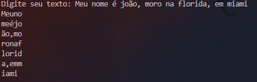

<h1>Chalange-Criptografia</h1>

<h2>Desafio retirado do site <a hrfe = "https://www.hackerrank.com/challenges/encryption/problem?isFullScreen=true">Hackerrank</a></h2>

Um texto precisa ser criptografado usando o seguinte esquema de criptografia.
Primeiro, os espaços são removidos do texto. Deixe  seja o comprimento deste texto.
Em seguida, os caracteres são escritos em uma grade, cujas linhas e colunas possuem as seguintes restrições:

Exemplo

Depois de remover os espaços, a len da string é de 34 caracteres longos. está entre 5 e 7, portanto está escrito na forma de uma grade com 5 linhas e 7 colunas.

